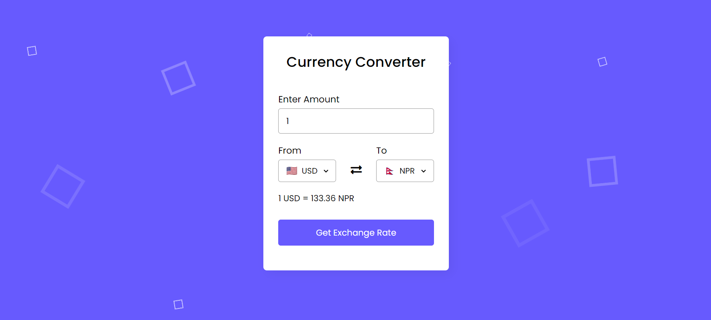

# Currency Converter App

## Overview

The Currency Converter App is a web application that allows users to convert currency amounts between different currencies. It fetches real-time exchange rates from an API and provides an intuitive interface for users to input currency amounts and select source and target currencies.

## Features

- **Real-Time Exchange Rates**: The app fetches real-time exchange rates from the ExchangeRate-API, ensuring accurate and up-to-date currency conversion calculations.
  
- **User-Friendly Interface**: With a simple and intuitive interface, users can easily input currency amounts and select source and target currencies using dropdown menus.
  
- **Dynamic Flag Display**: As users select different currencies, the app dynamically displays flags representing the selected currencies for a visually engaging experience.
  
- **Responsive Design**: Built with responsiveness in mind, the app adapts smoothly to various screen sizes and devices, offering a consistent experience across platforms.

## Technologies Used

- **HTML/CSS**: The frontend of the app is built with HTML and styled with CSS to provide a visually appealing and responsive design.
  
- **JavaScript**: The core functionality of the app is implemented using JavaScript, including fetching exchange rates from the API and handling user interactions.

## Usage

To use the Currency Converter App:

1. Clone this repository to your local machine.
2. Open the `index.html` file in your preferred web browser.
3. Enter the desired currency amount in the input field.
4. Select the source and target currencies from the dropdown menus.
5. Click the "Get Exchange Rate" button to calculate the converted amount.

## Preview

## Credits

- Flag icons provided by [Flag CDN](https://flagcdn.com/).
- Currency data provided by [ExchangeRate-API](https://www.exchangerate-api.com/).
